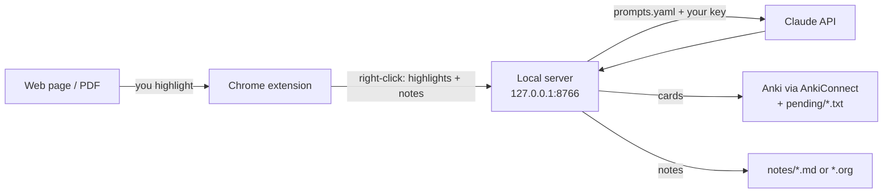

# Highlight → Anki / Zettel

A Chrome extension that turns what you highlight on any web page (or PDF)
into **Anki flashcards** and **Zettelkasten notes**, written by Claude and
saved to your disk.

- Highlight in **yellow** → right-click → *Generate Anki cards from yellow
  highlights*. Cards land in Anki (via AnkiConnect) and in an import file.
- Highlight in **blue** → right-click → *Create Zettel notes from blue
  highlights*. One atomic note per idea, as Markdown (Obsidian-ready) or
  org-roam files, cross-linked and tagged with your existing vocabulary.
- Attach a **note** to any highlight to tell the generator what you want
  ("make this a cloze", "link this to my note on X", "focus on the why").

Everything runs on your machine: the extension talks to a small local
server, which sends the page and your highlights to the Anthropic API with
**your** key.

---

## Contents

1. [How it works](#how-it-works)
2. [Setup](#setup)
3. [Using it](#using-it)
4. [Customising the prompts](#customising-the-prompts)
5. [Configuration reference](#configuration-reference)
6. [Security](#security)
7. [Troubleshooting](#troubleshooting)
8. [Development](#development)

---

## How it works



Two parts, both in this repository:

| Folder       | What it is                                                                                              |
| ------------ | ------------------------------------------------------------------------------------------------------- |
| `extension/` | Chrome extension (Manifest V3): the highlighter UI, colour picker, note box, right-click menu, PDF viewer |
| `server/`    | Local Python server: builds the prompt, calls Claude, writes the files, pushes cards into Anki           |

The extension never holds your API key: it sends the highlights to the
local server, and the server holds the key (read from a `.env` file that is
never committed) and does the rest. The extension's only other network use
is fetching a PDF you open, so its own viewer can render it; that request
carries your cookies for the PDF's own site, so PDFs behind a login work.

### The colour code

| Colour     | Meaning                                | Right-click action                          |
| ---------- | -------------------------------------- | ------------------------------------------- |
| **Yellow** | "I want to remember this" — facts, definitions, mechanisms | *Generate Anki cards from yellow highlights* |
| **Blue**   | "This is an idea worth keeping" — claims, insights, arguments | *Create Zettel notes from blue highlights*    |

Yellow and blue are independent: a page can have both, and each right-click
action only picks up its own colour. What you highlight is the whole input —
the generator never adds cards or notes for parts of the page you did not
highlight. It does read the surrounding paragraph (and the page as a whole)
so that each card or note is self-contained: pronouns resolved, names filled
in, context understood.

### Notes on highlights: steering the generator

Every highlight can carry a short note, typed by you. Think of it as your
side of the conversation with the generator. A note can:

- **Direct the output** — "make this a cloze", "one Basic card, ask *why*",
  "skip the second sentence", "this deserves two notes".
- **Add context the page lacks** — "this is about the 2008 crisis, not
  2020", "the 'he' here is Feynman".
- **Connect to what you already know** — "relates to my note on deliberate
  practice", "contradicts what Kahneman says about intuition".

Notes are sent to Claude clearly marked as *your* words, distinct from the
page's text, with instructions to follow them — and never to quote them or
mention that a note existed. So the note shapes the card or note without
appearing in it. Where a note conflicts with the default guidance in
`prompts.yaml`, the note wins (it cannot change the output format, the
one-idea-per-item rule, or the language rule).

Highlights and notes are **session-only**: reloading the page clears them,
so generate before you leave the page.

---

## Setup

You need: Google Chrome (or any Chromium browser), Python 3.11+,
[Anki](https://apps.ankiweb.net/) with the
[AnkiConnect](https://ankiweb.net/shared/info/2055492159) add-on (optional
but recommended), and an Anthropic API key.

### 1. Get an API key

Create one at <https://console.anthropic.com/settings/keys>. Generation
costs money on your Anthropic account (a typical page runs a few cents;
depends on the model and the page length).

### 2. Configure

```bash
git clone https://github.com/pmarcelino/highlight-anki-zettel.git
cd highlight-anki-zettel
cp .env.example .env
```

Open `.env` in any text editor and paste your key:

```
ANTHROPIC_API_KEY=sk-ant-...
```

That is the only required setting. `.env` is listed in `.gitignore`, so it
stays on your machine even if you fork and push this repository. The other
settings in `.env.example` (folders, deck, model, note format) are optional
— see [Configuration reference](#configuration-reference).

### 3. Start the server

```bash
./run.sh
```

The first run creates a virtual environment and installs dependencies; after
that it just starts. Leave it running while you use the extension (or put it
behind your process manager of choice — launchd, systemd, a tmux window). It
listens on `127.0.0.1:8766` only.

If the key is missing or `prompts.yaml` is broken, the server refuses to
start and prints the reason.

<details>
<summary>Windows (no <code>run.sh</code>)</summary>

```powershell
python -m venv .venv
.venv\Scripts\pip install -r requirements.txt
.venv\Scripts\uvicorn highlightanki.main:app --app-dir server --host 127.0.0.1 --port 8766
```
</details>

### 4. Load the extension

1. Chrome → `chrome://extensions`
2. Turn on **Developer mode** (top right)
3. **Load unpacked** → choose the `extension/` folder

An icon appears in the toolbar. Optional: pin it.

### 5. Anki (for cards)

Install the **AnkiConnect** add-on (code `2055492159`) and keep Anki open
while generating: cards go straight into your deck. Without AnkiConnect (or
with Anki closed), every run still writes a `.txt` file you can import with
**File → Import** — nothing is lost.

Cards use Anki's built-in **Basic** and **Cloze** note types plus a `Source`
field. If your Basic/Cloze note types have no `Source` field, add one
(Tools → Manage Note Types → Fields) or the AnkiConnect import will report
failures; the `.txt` file imports either way.

---

## Using it

1. **Arm the page.** Press **Alt+H** (Option+H on macOS) or click the
   toolbar icon. The badge shows **ON**. Arming is per tab, so text
   selection on other tabs behaves normally. Same key turns it off.
2. **Highlight.** Select text; a small panel appears next to the selection
   with a **yellow** swatch, a **blue** swatch, and **✎**.
   - Click a swatch to paint the highlight.
   - Click **✎** first to type a note, then a swatch. The highlight gets a
     dotted underline to show it carries a note.
3. **Edit.** Click any highlight to reopen its panel: edit the note (it saves
   as you type; Esc or clicking elsewhere closes), click a swatch to recolour,
   or **✗** to remove the highlight. Clearing the note box removes the note.
4. **Generate.** Right-click anywhere on the page:
   - **Generate Anki cards from yellow highlights** — a toast shows progress,
     then the result: `N card(s) → …/pending/<timestamp>-<page>.txt — imported
     N into Anki`. If Anki is closed the toast says so and the file waits.
   - **Create Zettel notes from blue highlights** — `N note(s) → …/notes`.

   Generation takes anywhere from twenty seconds to a couple of minutes for
   a long page. The toast stays until it finishes; you can keep reading.

### PDFs

Chrome renders PDFs in its own viewer, which extensions cannot touch. So
when a tab is **armed**, PDFs open in the extension's own viewer (bundled
PDF.js) instead, and everything above works the same — including
`arxiv.org/pdf/…` links without a `.pdf` extension. Arming a tab that already
shows a PDF switches it over; unarmed tabs keep Chrome's viewer.

Local `file://` PDFs need one extra toggle: `chrome://extensions` → this
extension → **Allow access to file URLs**.

### What gets written

**Cards** — `~/Documents/highlight-anki-zettel/anki-cards/pending/<timestamp>-<page>.txt`
(tab-separated, Anki's own import format, 6 columns: note type, deck, front,
back, source, tags). Tags are drawn from your vocabulary in
`anki-cards/tags.txt`; new tags are appended there so the vocabulary grows
with you.

**Notes** — `~/Documents/highlight-anki-zettel/notes/<timestamp>-<title>.md`, one
per note. Markdown (default) looks like:

```markdown
---
id: 3f1c…
title: retrieval practice beats re-reading because it forces reconstruction
tags: [learning, memory, retrieval-practice]
source: Make It Stick — https://…
---

# retrieval practice beats re-reading because it forces reconstruction

(the note, in the model's own words)

## Related

- [[20260921103012-spacing_effect|the spacing effect …]]

Source: Make It Stick — https://…
```

Notes generated together are cross-linked under *Related* with `[[wikilinks]]`
(Obsidian, Logseq, Zettlr…). Tags are chosen preferring the ones already
used in your notes folder. Set `HLANKI_NOTES_FORMAT=org` for org-roam files
instead (`:ID:` drawer, `#+roam_tags:`, `[[id:…]]` links; a running Emacs
with `server-start` gets its org-roam cache refreshed automatically).

---

## Customising the prompts

Everything Claude is told lives in **`prompts.yaml`** at the project root.
Open it, edit, save, restart the server (`Ctrl+C`, `./run.sh`). No code.

It has three sections:

- `shared.untrusted_note` — tells the model which parts of the prompt are
  web content (never to be obeyed) and which are your own notes (to be
  followed).
- `shared.comment_rule` — how your highlight notes steer the output.
- `cards.prompt` and `zettel.prompt` — the actual instructions for each
  action, with `$placeholders` the server fills in: `$title`, `$url`,
  `$page_text`, `$highlights`, `$vocabulary`, plus `$untrusted_note` and
  `$comment_rule` for the shared pieces.

Typical edits: change the number of cards per idea, add a house style ("always
ask *why*, never *what*"), demand a particular note length, ask for a
specific language, add domain rules ("for code, put the identifier in the
cloze"). Each section also has `max_tokens`; raise it if you ever see a
"response truncated" error on very long pages.

The JSON shape the model returns (card note type/front/back/tags; note
title/body/tags/related) is fixed by the server and is not affected by the
YAML.

---

## Configuration reference

All settings live in `.env` (copy from `.env.example`). Only the key is
required.

| Variable               | Default                                          | Purpose                                                             |
| ---------------------- | ------------------------------------------------ | ------------------------------------------------------------------- |
| `ANTHROPIC_API_KEY`    | —                                                | **Required.** Your Anthropic key.                                   |
| `HLANKI_MODEL`         | `claude-opus-4-8`                                | Model used for generation.                                          |
| `HLANKI_PENDING_DIR`   | `~/Documents/highlight-anki-zettel/anki-cards/pending`  | Where card import files are written.                                |
| `HLANKI_TAGS`          | `~/Documents/highlight-anki-zettel/anki-cards/tags.txt` | Your Anki tag vocabulary, one per line (created/extended for you).  |
| `HLANKI_DECK`          | `Default`                                        | Anki deck for new cards (must exist in Anki).                       |
| `HLANKI_NOTES_DIR`     | `~/Documents/highlight-anki-zettel/notes`               | Where Zettel notes are written. Point it at your Obsidian vault.    |
| `HLANKI_NOTES_FORMAT`  | `markdown`                                       | `markdown` or `org`.                                                |
| `HLANKI_PROMPTS`       | `./prompts.yaml`                                 | Alternative prompts file.                                           |
| `HLANKI_EXTENSION_ID`  | `neengcjabhhombdcejjnonclpdmbhiim`               | The only extension origin the server accepts (fixed by `key` in `manifest.json`). |

Folders are created on first use. The keyboard shortcut can be changed at
`chrome://extensions/shortcuts`.

---

## Security

- **Your key never enters the extension or the repository.** It is read
  from `.env` by the server process only, and transmitted only to
  `api.anthropic.com` over HTTPS, as the credential for your requests.
  Nothing in `extension/` reads or transmits it. `.env` is git-ignored.
- **The server is loopback-only** (`127.0.0.1:8766`): nothing outside your
  machine can reach it.
- **Web pages and other extensions cannot use it either.** Requests carrying
  a browser `Origin` other than this extension's own
  (`chrome-extension://neengcjabhhombdcejjnonclpdmbhiim`, pinned by the `key`
  in `manifest.json`) are rejected with 403, so neither a page you visit nor
  another installed extension can post to the server and spend your credits.
  Chrome's own private-network-access rules block page requests as well;
  this is a second fence.
- **Page text is treated as untrusted.** Every page-derived field — title,
  URL, page text, each highlight and its excerpt — reaches the model fenced
  in its own tag, and the prompt names those tags as material to learn from,
  never instructions. Only your own highlight notes are to be followed.
- **Your notes are yours.** The highlight panel (swatches and note box) is
  an extension page in its own iframe, not part of the web page: the page
  cannot read what you type, cannot see the panel's messages, and cannot
  forge a note. What was highlighted, with which colour and which note, is
  kept in the extension's memory, never in the page's DOM; a page that
  plants its own `data-hlanki-*` elements gets nothing sent. Synthetic
  (script-generated) mouse and keyboard events are ignored.
- **What leaves your machine:** the page title, URL, text, your highlights
  and notes, sent to the Anthropic API under your key (subject to
  Anthropic's API data policies); and, when you open a PDF in an armed tab,
  the extension fetches that PDF from its own URL to render it — with the
  cookies your browser already holds for that site, exactly as opening the
  PDF normally would. Nothing is sent anywhere else.

If you fork this repository, keep `.env` out of it. `git status` should
never list it; if it does, your `.gitignore` is missing.

---

## Troubleshooting

| Symptom                                                  | Cause / fix                                                                                      |
| -------------------------------------------------------- | ------------------------------------------------------------------------------------------------ |
| Toast: *Companion server not running?*                   | Start `./run.sh`. Check nothing else uses port 8766.                                             |
| Server prints *ANTHROPIC_API_KEY is not set*             | `.env` missing or empty. `cp .env.example .env` and add the key.                                 |
| Toast: *authentication_error*                            | The key in `.env` is wrong or revoked.                                                           |
| *Anki not running; import the file manually*             | Open Anki (with AnkiConnect) before generating, or import the `.txt` via File → Import.          |
| *imported 0 into Anki, N failed*                         | Deck does not exist, note type lacks a `Source` field, or the cards already exist (duplicates).  |
| Highlight panel does not appear                          | The tab is not armed (badge must show **ON**). Some pages block extensions (`chrome://`, Web Store). |
| PDF opens in Chrome's viewer, no highlighting            | Arm the tab first, or press Alt+H with the PDF open. For `file://`, enable *Allow access to file URLs*. |
| *response truncated (max_tokens)*                        | Raise `max_tokens` for that section in `prompts.yaml`.                                            |
| Reloaded the extension but the manifest changed          | Hit **Reload** on the extension card in `chrome://extensions`.                                    |

Port 8765 belongs to AnkiConnect; this server uses 8766 on purpose.

---

## Development

```bash
.venv/bin/pip install -r requirements-dev.txt
.venv/bin/pytest        # no network, no API calls
```

The suite loads the shipped `prompts.yaml`, so a broken edit shows up there
too. `extension/pdfjs/README.md` documents the vendored PDF.js version.

License: MIT (see `LICENSE`). PDF.js is Apache-2.0.
